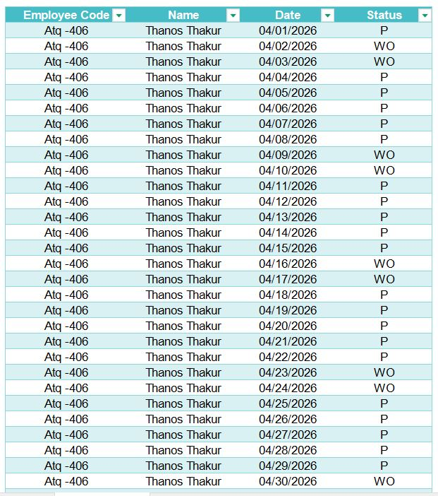
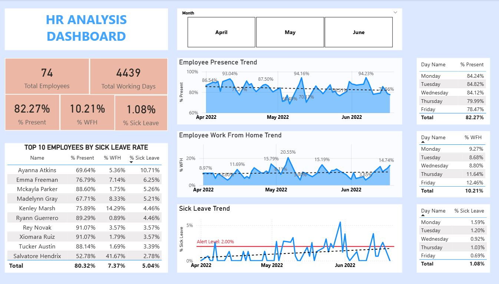

# HR ANALYTICS PROJECT

&nbsp;&nbsp;&nbsp;&nbsp;In this project, I utilized **Excel Power Query** and **Power BI** to process and transform raw attendance data into actionable insights. This project was developed based on specific requirements from an HR professional to streamline the monitoring of employee attendance and work-from-home patterns.

&nbsp;&nbsp;&nbsp;&nbsp; **_You can take a look at my LinkedIn:_** [Trung Bùi](https://www.linkedin.com/in/trungbui011/)

&nbsp;&nbsp;&nbsp;&nbsp;The [Raw Data](./Attendance-Sheet-2022-2023.xlsx) includes attendance sheets for 3 months (April - June 2022). Each month is organized into its own worksheet, with the final sheet serving as the Attendance Key. It includes **_Employee Codes_**, _**Names**_, and their daily Attendance Status (Present, Work From Home, Sick Leave,...) recorded in a wide matrix format.

&nbsp;&nbsp;&nbsp;&nbsp;In case you don't know exactly what P, WFH, SL... mean, you can find the full definitions in the **Attendance Key** table below.

## REQUIREMENTS
- **Understanding Employee Work Preferences:** Compare In-Office vs WFH ratios, specifically focusing on Monday and Friday patterns to help HR optimize office policies.
- **Monitoring Sick Leave Trends:** Track daily sick leave percentages to detect potential outbreaks (like Covid) early, allowing HR to implement safety precautions and backup plans.

## DATA GATHERING & TRANSFORMATION
- Unpivoting: transform date columns into rows. This changes the data from a wide format to a long list (Employee - Date - Status).
- I also Added a "Day of Week" column to help analyze working patterns on specific days like Mondays or Fridays.
- You can download the cleaned data [here](./HR_Analytics_Cleaned.xlsx)

## DASHBOARDING
- **KPI Cards** (Total Employees, Total Working Days, % Presence, % WFH, % Sick Leave): These metrics allow HR to monitor attendance on a regular basis with high flexibility.
- **Presence and Work From Home (WFH) Trend:** This is an important insight that HR care a lot. By looking at the ratio, we can see that Friday (12.46%) has the highest remote work rate, confirming the need for flexible Friday policies.
- **Sick Leave Trend with Alert Level:** I added an Alert Level at 2.00%. This acts as an "Early Warning System." Any peak above this red line signals HR to investigate potential outbreaks or health issues immediately.

In case you want to see every detail, you can download the full **Power BI** dashboard [here](HR-Analysis.pbix).

## RECOMMENDATIONS
- Optimizing Hybrid Work Policy: Since Friday has the highest WFH rate (12.46%), HR should formalize a "Flexible Friday" policy. This ensures employees feel supported while maintaining office operations with a leaner onsite team.
- Health Alert Response: The 2.00% Alert Level in the Sick Leave trend should be integrated into an automated notification system. If this threshold is crossed (as seen in early June), HR should immediately trigger health safety protocols or internal surveys to check for potential outbreaks.
- Employee Support Program: Take special care of Employees with high Sick Leave rates, we should conduct "Care Calls" or wellness check-ins. We need to find out whether they are facing long-term health issues or burnout (mental problems), providing support rather than just monitoring attendance.
- Space Management: Since presence drops significantly towards the end of the week (Thursday & Friday), the company can save energy costs (electricity, AC) by closing certain office zones on these days.

## Feedback & Contributions
I welcome any feedback or suggestions. Feel free to open an issue or reach out!
